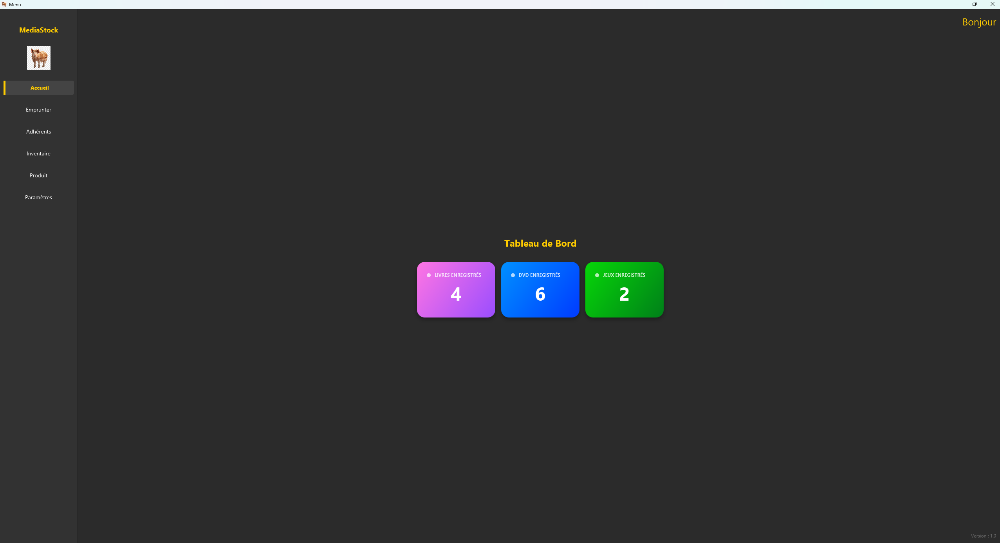
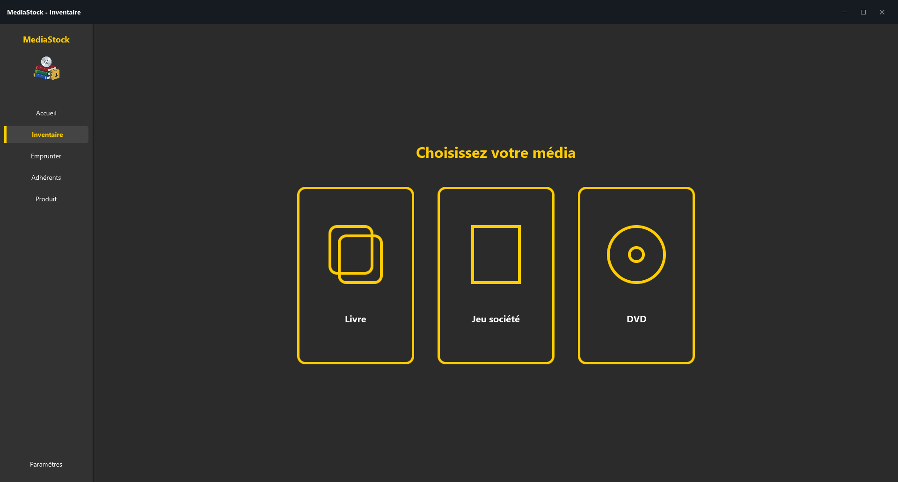

# 📚 MediaStock

[](#)
[](#)
[](#)
[](#)

**MediaStock** est un logiciel de bureau moderne conçu pour la gestion complète d'une médiathèque : bibliothèque,
ludothèque et vidéothèque.  
Développé en **Java 25** avec **JavaFX**, l'application propose une interface fluide, intuitive et pensée pour faciliter
le travail quotidien des bibliothécaires.

---

## ✨ Fonctionnalités principales

### 📊 Tableau de bord

* **Vue d'ensemble :** Statistiques en temps réel sur les ressources enregistrées (Livres, DVD, Jeux de société).
* **Alertes :** Suivi automatisé et affichage direct des exemplaires en retard.

### 📦 Gestion de l'inventaire

* **Multi-médias :** CRUD complet (Ajout, modification, suppression) pour les différents types de médias.
* **Efficacité :** Recherche dynamique, tri et pagination fluide des données.
* **Technologie :** Génération automatique de **codes-barres EAN-13** pour faciliter le suivi physique des exemplaires.

### 👥 Gestion des adhérents & Emprunts

* **Suivi complet :** Inscription, modification des membres et consultation de l'historique de prêt.
* **Scan Rapide :** Système de scan par **webcam intégrée** (lecture de codes-barres) pour accélérer les retours et les
  emprunts.
* **Sécurité métier :** Vérification automatique des règles (quota maximum d'emprunts, disponibilité de l'exemplaire).

---

## 🛠️ Stack Technique & Architecture

Le projet repose sur une architecture en couches de type **MVC (Modèle-Vue-Contrôleur)** afin de garantir une base de
code claire, sécurisée et maintenable.

* **Langage :** Java 25
* **Interface Graphique :** JavaFX (avec Scene Builder & FXML)
* **Base de données :** MySQL (JDBC direct)
* **Outils externes :** ZXing (Lecture/Génération de codes-barres), JavaCV (Webcam), JBCrypt (Sécurité des mots de
  passe), Dotenv (Variables d'environnement).

```text
/model       → Entités métiers (Livre, DVD, Adherent, Emprunt...)
/dao         → Accès aux données sécurisé (PreparedStatement)
/service     → Logique métier (règles d'emprunt, orchestration)
/controller  → Interface JavaFX et gestion des événements utilisateur
````

-----

## 🚀 Installation & Démarrage

### Prérequis

* **Java JDK 25+** installé
* **MySQL 8.0+** fonctionnel
* **Maven** (inclus via le wrapper `mvnw` du projet)

### 1\. Préparation de la base de données

Connectez-vous à votre serveur MySQL et créez la base de données :

```sql
CREATE DATABASE mediastock;
```

Ensuite, importez la structure des tables en exécutant le script fourni : `sql/mediastock_Vierge.sql`.

### 2\. Configuration sécurisée

Créez un fichier nommé exactement `.env` à la racine du projet (au même niveau que le fichier `pom.xml`) et ajoutez-y
vos identifiants MySQL :

```env
DB_URL=jdbc:mysql://localhost:3306/mediastock
DB_USER=root
DB_PASSWORD=votre_mot_de_passe_ici
```

### 3\. Compilation et Lancement

Ouvrez un terminal à la racine du projet et exécutez les commandes suivantes :

```bash
# Compiler le projet et télécharger les dépendances
mvn clean install

# Lancer l'application JavaFX
mvn javafx:run
```

-----

## 📸 Aperçu de l'interface

\<div align="center"\>
\
<br>
\<em\>Tableau de bord et suivi des retards\</em\>
<br><br>
\
<br>
\<em\>Gestion de l'inventaire multimédia\</em\>
\</div\>

-----

## 🤝 Contribuer & Documentation

Les contributions sont les bienvenues \! Merci de consulter les fichiers suivants avant toute Pull Request :

* [`CONTRIBUTING.md`](https://www.google.com/search?q=CONTRIBUTING.md) : Règles de contribution
* [`CODE_OF_CONDUCT.md`](https://www.google.com/search?q=CODE_OF_CONDUCT.md) : Code de conduite
* [`SECURITY.md`](SECURITY.md) : Signalement de failles

Retrouvez la [documentation complète dans le dossier `/docs`](https://www.google.com/search?q=docs/README-DOCS.md).

-----

## 📄 Licence

Ce projet est distribué sous licence **MIT**. Voir le fichier [`LICENSE`](https://www.google.com/search?q=LICENSE) pour
plus de détails.
