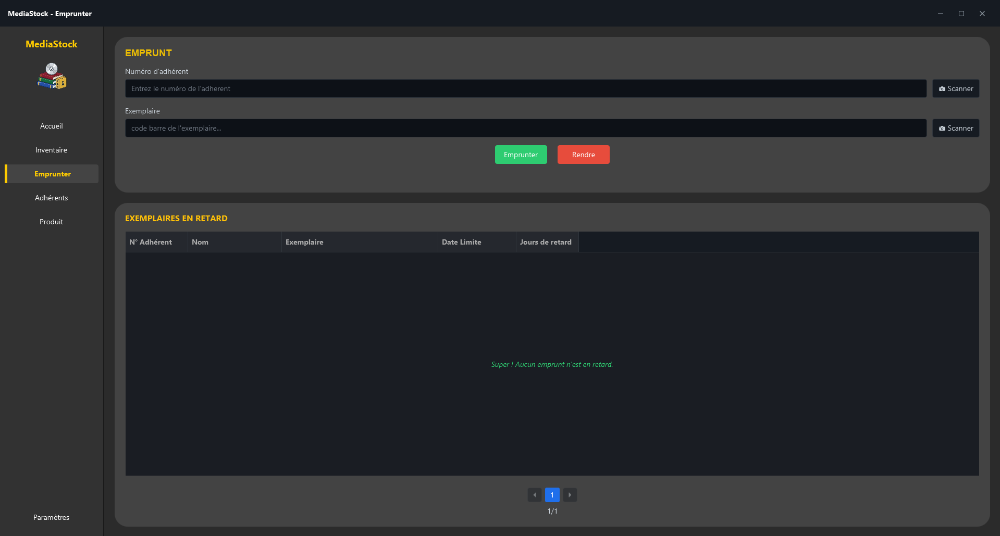

# 📚 MediaStock

[](https://www.oracle.com/fr/java/technologies/downloads/#java25)
[](https://openjfx.io/)
[](https://www.mysql.com/fr/)
[](https://maven.apache.org/)

**MediaStock** est un logiciel de bureau moderne conçu pour la gestion complète d’une médiathèque : bibliothèque,
ludothèque et vidéothèque.  
Développé en **Java 25** avec **JavaFX**, l’application propose une interface fluide, intuitive et pensée pour faciliter
le travail quotidien des bibliothécaires.

---

## ✨ Fonctionnalités principales

### 📊 Tableau de bord

- **Vue d’ensemble :** statistiques en temps réel sur les ressources enregistrées (livres, DVD, jeux de société).
- **Alertes :** suivi automatisé et affichage direct des exemplaires en retard.

### 📦 Gestion de l’inventaire

- **Multi-médias :** CRUD complet (ajout, modification, suppression) pour les différents types de médias.
- **Efficacité :** recherche dynamique, tri et pagination fluide des données.
- **Technologie :** génération automatique de **codes-barres EAN-13** pour faciliter le suivi physique des exemplaires.

### 👥 Gestion des adhérents & emprunts

- **Suivi complet :** inscription, modification des membres et consultation de l’historique de prêt.
- **Scan rapide :** système de scan par **webcam intégrée** (lecture de codes-barres) pour accélérer les retours et les
  emprunts.
- **Sécurité métier :** vérification automatique des règles (quota maximum d’emprunts, disponibilité de l’exemplaire).

---

## 🛠️ Stack technique & architecture

Le projet repose sur une architecture en couches de type **MVC (Modèle-Vue-Contrôleur)** afin de garantir une base de
code claire, sécurisée et maintenable.

- **Langage :** Java 25
- **Interface graphique :** JavaFX (avec Scene Builder & FXML)
- **Base de données :** MySQL (JDBC direct)
- **Outils externes :** ZXing (lecture/génération de codes-barres), JavaCV (webcam), JBCrypt (sécurité des mots de
  passe), Dotenv (variables d’environnement)

```text
/model       → Entités métiers (Livre, DVD, Adherent, Emprunt...)
/dao         → Accès aux données sécurisé (PreparedStatement)
/service     → Logique métier (règles d’emprunt, orchestration)
/controller  → Interface JavaFX et gestion des événements utilisateur
```

---

## 🚀 Installation & démarrage

### Prérequis

- **Java JDK 25+** installé (Nous recommandons fortement Liberica JDK 25 Full pour inclure JavaFX nativement)
- **MySQL 8.0+** fonctionnel
- **Maven** (inclus via le wrapper `mvnw` du projet, ou installable manuellement)

### 1. Configuration de l'environnement (JDK & Maven)

#### ☕ Installer Liberica JDK Full 25

Le projet utilisant JavaFX, l'utilisation de la version "Full" de Liberica JDK est recommandée car elle intègre les
modules JavaFX directement.

1. Rendez-vous sur la [page de téléchargement de BellSoft (Liberica JDK)](https://bell-sw.com/pages/downloads/).
2. Sélectionnez **Java 25** et votre système d'exploitation.
3. **Important :** Veillez à bien télécharger le package **"Full JDK"** (et non "Standard JDK").
4. Installez-le. Si vous utilisez IntelliJ IDEA ou Eclipse, allez dans les paramètres du projet et sélectionnez ce
   nouveau JDK comme SDK par défaut.

#### 🏗️ Installer Maven (si vous ne souhaitez pas utiliser le wrapper)

Ce projet inclut déjà un wrapper Maven (`mvnw` / `mvnw.cmd`) qui permet d'exécuter Maven sans l'installer. Vous pouvez
simplement utiliser `./mvnw` à la place de `mvn` dans les commandes ci-dessous.
Cependant, pour l'installer globalement sur votre machine :

* **Windows :** Téléchargez l'archive sur le site d'Apache Maven, extrayez-la, puis ajoutez le chemin du dossier `bin` à
  votre variable d'environnement `PATH`. (Alternative via Winget : `winget install Microsoft.Maven`).
* **macOS (via Homebrew) :** `brew install maven`
* **Linux (Debian/Ubuntu) :** `sudo apt install maven`

### 2. Préparation de la base de données

Connectez-vous à votre serveur MySQL et créez la base de données :

```sql
CREATE DATABASE mediastock;
```

Ensuite, importez la structure des tables en exécutant le script fourni : `sql/mediastock_Vierge.sql`.

### 3. Configuration sécurisée

Créez un fichier nommé exactement `.env` à la racine du projet (au même niveau que le fichier `pom.xml`) et ajoutez-y
vos identifiants MySQL :

```env
DB_URL=jdbc:mysql://localhost:3306/mediastock
DB_USER=root
DB_PASSWORD=votre_mot_de_passe_ici
```

### 4. Compilation et lancement

Ouvrez un terminal à la racine du projet et exécutez les commandes suivantes :

```bash
# Compiler le projet et télécharger les dépendances
mvn clean install

# Exécuter les tests unitaires
mvn test

# Lancer l'application JavaFX
mvn javafx:run
```

---

## 📖 Documentation technique (Javadoc)

Conformément aux bonnes pratiques de versionnement avec Git, les fichiers HTML générés automatiquement (comme la
Javadoc) ne sont pas inclus dans ce dépôt. Ce choix permet de :

- garder un historique Git plus propre,
- éviter les conflits de fusion sur des fichiers générés,
- ne pas alourdir inutilement le dépôt.

### Méthode 1 — Génération via Maven en ligne de commande

Depuis la racine du projet, exécutez :

```bash
mvn javadoc:javadoc
```

Les fichiers générés seront disponibles dans :

```text
target/site/apidocs/
```

### Méthode 2 — Génération via IntelliJ IDEA avec Maven

Si vous utilisez **IntelliJ IDEA**, vous pouvez générer la Javadoc directement depuis l’interface :

1. Ouvrez l’onglet **Maven** situé dans la barre latérale droite d’IntelliJ IDEA.
2. Déroulez votre projet **MediaStock**.
3. Ouvrez la section **Plugins**.
4. Déroulez **javadoc**.
5. Double-cliquez sur **javadoc:javadoc**.

Vous pouvez également retrouver la documentation générée dans le même dossier :

```text
target/site/apidocs/
```

> 💡 **Astuce :** si l’onglet Maven n’apparaît pas dans IntelliJ IDEA, vérifiez que le projet a bien été importé comme
> projet **Maven** à partir du fichier `pom.xml`.

---

## 📸 Aperçu de l’interface

### Tableau de bord


### Gestion des retards



### Inventaire


---

## 🤝 Contribuer & documentation

Les contributions sont les bienvenues ! Merci de consulter les fichiers suivants avant toute Pull Request :

- [`CONTRIBUTING.md`](CONTRIBUTING.md) : règles de contribution
- [`CODE_OF_CONDUCT.md`](CODE_OF_CONDUCT.md) : code de conduite
- [`SECURITY.md`](SECURITY.md) : signalement de failles

Retrouvez la documentation complète dans le dossier [`/docs`](docs/README-DOCS.md).

---

## 📄 Licence

Ce projet est distribué sous licence **MIT**. Voir le fichier [`LICENSE`](LICENSE) pour plus de détails.
